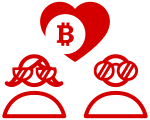

## Was
### Wir verbinden alle digitalen Formen von Wertanlagen

<a href="https://internetofcoins.org" target="_blank">Internet of Coins</a> ist eine dezentralisierte Plattform mit der Funktion ein optimales ganzheitliches Finanznetzwerk zu bilden, das alle möglichen digitalen Formen von Werten verbindet. Unser Ziel ist es alle Token basierten Wertesysteme in einem finanziell liquidem Netz zu verbinden.   In den letzten zwei Jahren wurde der Grundstein hierfür gelegt. Das Grundsystem wurde von einem Team von Spezialisten entwickelt, die ihre Zeit der Schöpfung eines innovativen open-source Netzwerkagenten mit dem Namen <a href="https://github.com/internetofcoins/hybridd" target="_blank"><i>hybridd</i></a> widmen, der verschiedene Blockchains direkt miteinander verbindet.
  
  

  
<b>Existierende Wallets benötigen keine Änderungen or Anpassungen um ihre Blockchain und ihr Wertsystem in dieses autonome dezentralisierte Netzwerk integrieren zu können.</b>  Die aktuellen Entwicklungen bezüglich Kryptowährungen schäumen bereits über vor Kreavitität. Wir wollen das diese Entwicklungen flächendeckend und parallel weiter gehen ohne eine künstliche Limitierung einzuführen. 

  

<b>Klick auf die Knöpfe unten um auf dem Laufenden zu bleiben, oder lies unser Whitepaper oder schau unsere Bedingungen an.</b>

