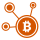

## 如何
### 区块链和价值体系的模块互联

我们已经开发了一个点对点的互通平台系统<a href="https://github.com/internetofcoins/hybridd" target="_blank"><i>hybridd</i></a>. 这样的页面具有连接的价值系统和同步输入的能力以及传输数据通过可扩展的数据链，我们称之为 <i>weavechain</i>.   <b>整个系统是模块化的。</b>   从他的调度与路由引擎中，各种虚拟币的接口和适配器，取决于其点对点的模块通信系统。

  

我们的最终目标是让每一个虚拟币自主成为大规模群分散全球金融互动部分。我们的目标是通过使网络中的任何参与者 建立价值的标记，称为混合资产，连接整个市场的价值体系和区块链。  <b>我们尽力让每一个虚拟币自主的链接成一个巨大的分散的经济活动中来，通过我们称之为weavechain.</b>   整个代码使可能将是开源的，可以在一个不以营利为目的的基础上，免费向所有人开放，为了建立我们说的公正的 <a href="https://internetofcoins.org" target="_blank">Internet of Coins</a>.

  

<a href="https://internetofcoins.org" target="_blank">Internet of Coins</a> 有能力通过久经考验的标准互联网协议安全通信，以及能够采用Deep Web分层网络<a href="https://www.torproject.org/" target="_blank">TOR</a>, <a href="https://geti2p.net/" target="_blank">I2P</a> 或者 <a href="https://zeronet.io/" target="_blank">ZeroNet</a> 当在各个节点之间通讯时。 Hybrid 资产构造函数能够承担流动性和兼容性通过不通的请尽快了和分账式的系统。

  

<b>无需更改即可加入虚拟币或价值体系成为其一员并融入这个变化的网络，一个独特的分配模型确保虚拟币带有一个小的<a href="http://coinmarketcap.com/" target="_blank">市场价值</a>获得必要的流动性支持在一个健康的cryptosphere交换与关联。在这种方式中，我们寻求支持和扩大市场对保持多样性和多元化生态系统。

