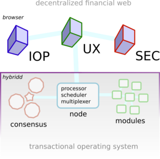

TOS /tɒs/, short for _transactional operating system_, is an acronym used to describe the command-based modular operating system powering [Internet of Coins](https://internetofcoins.org). It consists of initialization, bootstrap, processor and scheduling code and provides scheduled handling of processes using a transactional data model.
 
Usually the Internet of Coins TOS runs daemonized on top of another operating system like Linux. In that case it runs as a [NodeJS](https://nodejs.org/) executable daemon called [_hybridd_](../hybridd) which creates its own environment. Additionally TOS can also run downcompiled on low-end hardware such as microcontrollers for use in Internet of Things applications, although functionality in that case will be limited. Next to that it is possible to run the system entirely in the browser.

One of the main design goals of Internet of Coins is to form a [decentralized financial web](../dfw) on which decentralized transactional applications like [cryptocurrencies](../cryptocurrency) and decentralized contracts can be run. This implies that the TOS behind it is naturally also a decentralized node-to-node or [peer-to-peer](../p2p) system.

From the user perspective we focus heavily on interoperability, user experience and security. These three pillars are to form the core usage experience of Internet of Coins. On the node side we make sure to develop the TOS [_hybridd_](../hybridd) continually towards a decentralized, consensus-based and modular node system.
