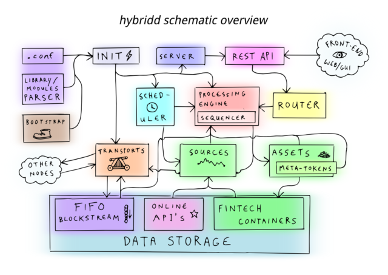

The core node processing and scheduling engine powering [Internet of Coins](https://internetofcoins.org) is a daemon called _hybridd_. It functions as a [transactional operating system](../tos) to create a [decentralized financial web](../dfw), by employing modules that in turn manage [cryptocurrencies](../cryptocurrency), network transports, information sources, smart contracts, swarm transactions and decentralized applications.

Components that comprise _hybridd_ are a [transactional operating system](../tos) containing a process manager and scheduler, router and [REST-API](../rest), modules for sources, assets, transports and [DAPPS](../dapp), and a front-end for desktop and mobile that runs in the browser.

You can find more information about <i>hybridd</i> on our <a href="https://github.com/internetofcoins/hybridd">Github page</a>.