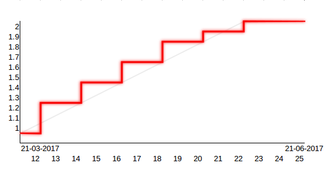

## Terms
<h3>"The palest ink is better than the best memory."  -- Chinese proverb</h3>
#### Early Birds
Looking for an opportunity to participate before the launch starts? Early Birds are eligible to participate for a price of $0.95 per HYBRID token, 5% below the opening price. Further, the same rewards apply as for all other participants.
  **Interested? Send us an e-mail before April 1st at <a href="mailto:earlybirds@internetofcoins.org">earlybirds@internetofcoins.org</a>.  Minimum entry for Early Bird advantages: 10 BTC or equivalent.**
   
#### Overview
These terms outline the details on how funds raised by the Internet of Coins project will be used, and to which rules the fundraiser as well as its participants are bound. Every effort has been made to spell out a clear and transparent summary of what is contained in the legal terms. If you have any questions, do not hesitate to contact the Internet of Coins team using the contact form on the home page. This summary may be subject to change. The legal terms can be found below.
  
#### Accountability
 Internet of Coins is held accountable to how collected funds are being spent by the appointed sequestration organization, the <a href="https://nlnet.nl" target="_blank">NLnet Foundation</a>. Every payment, whether regular or bounty, must be requested before funds can be spent, to safeguard the financial situation of Internet of Coins, and to make sure developments can proceed in a steady and orderly fashion. In this way all funds vested by crowdfunding participants are legally and procedurally safeguarded. Read more <a href="https://coinstorm.net/terms/NLnet_letter.pdf">here</a>.
  
The pie chart below gives an overview of how collected funds will be allocated in the project. 
In short, as crowdfund proceedings grow, we intend to scale up more in development and community bounties. 
<iframe src="/piechart/index.html" frameborder="0" style="width: 100%; height: 460px; border: 0px solid #CCC; border-radius: 12px;">You need a frames capable browser to access the pie chart detailing funding round spending.</iframe>
#### Milestones
In the following roadmap we present the milestones the project is to reach every quarter in the time ahead.
  

  
The project manager of the Internet of Coins team, along with the board of recommendation, will keep track of the advances in development, marketing and all other details regarding the project and its timeline. Updates will be sent out in the form of newsletters to cover unfolding events and milestones reached. Every quarter the developments done will be assessed and planning for the following quarter will be adjusted where necessary to enable a timely response to technological progress outside the project as well as what is happening in the cryptocurrency markets. 
  
#### Tokens
The tokens distributed for the Internet of Coins project are called HYBRID. These tokens will be made available initially on seven different blockchain ecosystems simultaneously, namely <a href="https://bitcoin.com" target="_blank">Bitcoin</a> (BTC), <a href="https://ethereum.org" target="_blank">Ethereum</a> (ETH), <a href="https://counterparty.io" target="_blank">CounterParty</a> (XCP), <a href="http://nxt.org/" target="_blank">NXT Platform</a> (NXT), <a href="https://www.nem.io/" target="_blank">New Economy Movement</a> (XEM), <a href="https://wavesplatform.com/" target="_blank">Waves Platform</a> (WAVES) and <a href="https://bitshares.org/" target="_blank">Bitshares</a> (BTS).
There will be 1000000 (one million) tokens available on each ecosystem. During the crowdfund 900000 (nine hundred thousand) of these tokens will be offered to those taking part. 100000 (one hundred thousand) tokens will be reserved for crowdfund reward payouts.
 During the crowdfund the price per HYBRID token will increase over time. Once the fundraiser is over, tokens will not be subject to inflation other than the moments that HYBRID is expanded to new blockchains.  Furthermore, as long as the project has the ability to proceed as planned, crowdfund token holders will receive rewards in the three years following the fundraiser. These will be distributed as follows:<small> 
in 2018 5% of remaining 10% reserved tokens, 
in 2019 3% of remaining 10% reserved tokens, 
in 2020 2% of remaining 10% reserved tokens, </small>
In addition, token holders will receive a 5% token bonus of every new blockchain assetsystem officially hooked up to HYBRID by the Internet of Coins team. 
<em>X-axis: week number, Y-axis: price factor</em>
  
#### Important
Listed below are the official addresses on which funds are to be received. Any other address than those mentioned below is invalid and not part of the Internet of Coins crowdfund. Users must check carefully when participating that addresses in their wallet software are correct, in order to avoid sending their funds to the wrong address.
 

<table style="text-align: left;">
<thead><tr><th>Symbol &nbsp;&nbsp;&nbsp;&nbsp;&nbsp;</th><th>Public key address</th></tr></thead>
<tbody>
<tr><td>BTC</td><td>14aV8dULoL67i6xQncfmFsbFaEtpRKskC2</td></tr>
<tr><td>XCP</td><td>1BshWVmV1o4ZPWRvTGVMGsXMmQaV1qAouw</td></tr>
<tr><td>ETH</td><td>0x197A920123DDa17040A065457Ef0c01B28A54045</td></tr>
<tr><td>NXT</td><td>NXT-FCXQ-K5NB-EA5E-CF36G</td></tr>
<tr><td>XEM</td><td>NB6TCTRBT7KUN5T5337LBSBIAYHL375VHCFZNOAU</td></tr>
<tr><td>WAVES</td><td>3P6xW7z9rjfGcoTeEiitoWfHWMbZ5j2GZkN</td></tr>
<tr><td>BTS</td><td>internet-of-coins</td></tr>
</tbody></table>

  
#### Legal
Please note that this summary of the terms does not constitute to be a prospectus of any sort, is not a solicitation for investment or an initial public offering or share/equity offering and does not pertain in any way to an offering of securities in any jurisdiction.
The contribution to the Internet of Coins project does not involve the exchange of cryptocurrencies for any form of ordinary shares, neither does the HYBRID tokens holder receive any form of guaranteed dividend or other revenue right. HYBRID tokens only provide their holder – if and to the extent the IoC environment is successfully developed and deployed – with a right to use the IoC environment (usage license).
  
The full legal version of the terms can be downloaded here in PDF format. Users are advised to read this before participating in the crowdfund.  
<a class="page-scroll btn btn-xl" href="/IoC_crowdfund_terms.pdf" target="_blank">legal terms</a>
  