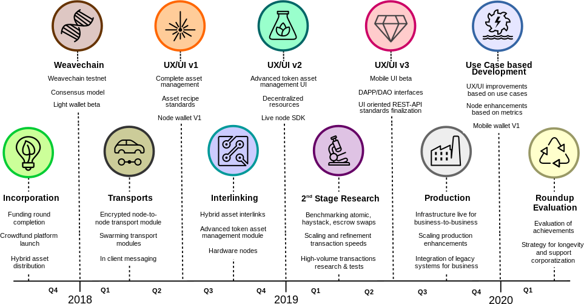

## Условия
<h3>"Самые бледные чернила лучше, чем наилучшая память."  -- Китайская пословица</h3>
#### Early Birds
Ищете возможность принять участие в кампании до ее начала? Ранние последователи (Early Birds) имеют право на участие в краудфандинге по цене $0.95 за HYBRID токен, на 5% ниже цены после официального старта кампании. В последствии, участники получают все те же вознаграждения, что и остальные.
  **Вам интересны такие условия? Тогда свяжитесь с нами по e-mail <a href="mailto:earlybirds@internetofcoins.org">earlybirds@internetofcoins.org</a> до 1 апреля.  Минимальный входной порог в программу раннего краудфандига – 10 BTC или его эквивалент в любой другой валюте с которой мы работаем.**
   
#### Обзор
These terms outline the details on how funds raised by the Internet of Coins project will be used, and to which rules the fundraiser as well as its participants are bound. Every effort has been made to spell out a clear and transparent summary of what is contained in the legal terms. If you have any questions, do not hesitate to contact the Internet of Coins team using the contact form on the home page. This summary may be subject to change. The legal terms can be found below.
  
#### Ответственность
 Internet of Coins is held accountable to how collected funds are being spent by the appointed sequestration organization, the <a href="https://nlnet.nl" target="_blank">NLnet Foundation</a>. Every payment, whether regular or bounty, must be requested before funds can be spent, to safeguard the financial situation of Internet of Coins, and to make sure developments can proceed in a steady and orderly fashion. In this way all funds vested by crowdfunding participants are legally and procedurally safeguarded. Read more <a href="https://coinstorm.net/terms/NLnet_letter.pdf">here</a>.
  
Диаграмма показывает каким образом собранные средства будут использованы в проектной деятельности. 
In short, as crowdfund proceedings grow, we intend to scale up more in development and community bounties. 
<iframe src="/piechart/index.html" frameborder="0" style="width: 100%; height: 460px; border: 0px solid #CCC; border-radius: 12px;">You need a frames capable browser to access the pie chart detailing funding round spending.</iframe>
#### Milestones
In the following roadmap we present the milestones the project is to reach every quarter in the time ahead.
  

  
The project manager of the Internet of Coins team, along with the board of recommendation, will keep track of the advances in development, marketing and all other details regarding the project and its timeline. Updates will be sent out in the form of newsletters to cover unfolding events and milestones reached. Every quarter the developments done will be assessed and planning for the following quarter will be adjusted where necessary to enable a timely response to technological progress outside the project as well as what is happening in the cryptocurrency markets. 
  
#### Токены
Токен, распределяемые проектом Internet of Coins называются HYBRID. Первоначально они будут доступны одновременно на семи различных блокчейн экосистемах, а именно <a href="https://bitcoin.com" target="_blank">Bitcoin</a> (BTC), <a href="https://ethereum.org" target="_blank">Ethereum</a> (ETH), <a href="https://counterparty.io" target="_blank">CounterParty</a> (XCP), <a href="http://nxt.org/" target="_blank">NXT Platform</a> (NXT), <a href="https://www.nem.io/" target="_blank">New Economy Movement</a> (XEM), <a href="https://wavesplatform.com/" target="_blank">Waves Platform</a> (WAVES) и <a href="https://bitshares.org/" target="_blank">Bitshares</a> (BTS).
В каждой из экосистем будет доступен 1000000 (один миллион) токенов. Во время краудфандинга 900000 (девятьсот тысяч) из них будут распределены между его участниками. 100000 (сто тысяч) токенов будет зарезервировано под выплаты краудфандинговых вознаграждений (см. ниже).
 Во время краудфандинга цена HYBRID токенов будет со временем увеличиваться. После окончания сбора средств количество токенов не будет увеличиваться кроме случаев расширения платформы на новых блокчейнах с соответствующим выпуском токенов.  Также, по мере продолжения проекта владельцы токенов будут получать вознаграждения в течение трех лет после кампании по сбору средств. Вознаграждения будут распределятся следующим образом:<small> 
в 2018 – 5% от оставшихся 10% зарезервированных токенов, 
в 2019 – 3% от оставшихся 10% зарезервированных токенов, 
в 2020 – 2% от оставшихся 10% зарезервированных токенов, </small>
В дополнение к этому, владельцы токенов получат дополнительный бонус в размере 5% при каждом добавлении новой блокчейн системы в HYBRID экосистему командой Internet of Coins. 
<em>X-axis: номер недели, Y-axis: множитель цены</em>
  
#### Важно
Ниже приведен официальный список адресов на которые принимаются средства. Любой другой адрес кроме приведенных ниже не является часть краудфандинговой кампании Internet of Coins. Users must check carefully when participating that addresses in their wallet software are correct, in order to avoid sending their funds to the wrong address.
 

<table style="text-align: left;">
<thead><tr><th>Криптовалюта &nbsp;&nbsp;&nbsp;&nbsp;&nbsp;</th><th>Адрес кошелька</th></tr></thead>
<tbody>
<tr><td>BTC</td><td>14aV8dULoL67i6xQncfmFsbFaEtpRKskC2</td></tr>
<tr><td>XCP</td><td>1BshWVmV1o4ZPWRvTGVMGsXMmQaV1qAouw</td></tr>
<tr><td>ETH</td><td>0x197A920123DDa17040A065457Ef0c01B28A54045</td></tr>
<tr><td>NXT</td><td>NXT-FCXQ-K5NB-EA5E-CF36G</td></tr>
<tr><td>XEM</td><td>NB6TCTRBT7KUN5T5337LBSBIAYHL375VHCFZNOAU</td></tr>
<tr><td>WAVES</td><td>3P6xW7z9rjfGcoTeEiitoWfHWMbZ5j2GZkN</td></tr>
<tr><td>BTS</td><td>internet-of-coins</td></tr>
</tbody></table>

  
#### Legal
Please note that this summary of the terms does not constitute to be a prospectus of any sort, is not a solicitation for investment or an initial public offering or share/equity offering and does not pertain in any way to an offering of securities in any jurisdiction.
The contribution to the Internet of Coins project does not involve the exchange of cryptocurrencies for any form of ordinary shares, neither does the HYBRID tokens holder receive any form of guaranteed dividend or other revenue right. HYBRID tokens only provide their holder – if and to the extent the IoC environment is successfully developed and deployed – with a right to use the IoC environment (usage license).
This crowdfund will not involve any fiat currencies and will strictly be done in cryptocurrencies.
  
Полная официальная версия условий может быть загружена здесь в формате PDF. Мы рекомендую пользователям ознакомится с ними перед участием в кампании по сбору средств.  
<a class="page-scroll btn btn-xl" href="/IoC_crowdfund_terms.pdf" target="_blank">legal terms</a>
  